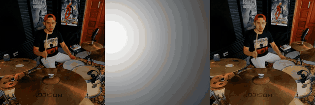

<div align="center">

# ✨ LiveLight

### Real-time Streaming Video Relighting with Interactive Control

**ACM Transactions on Graphics (TOG) 2026**

Yue Ma<sup>1</sup>, Jiangming Wang<sup>1</sup>, Yucheng Wang<sup>1</sup>, Xilai Wang<sup>1</sup>, Zhiyuan Li<sup>2</sup>, Xinyu Wang<sup>3</sup>, Hongyu Liu<sup>1</sup>, Ruofan Liang<sup>4</sup>, Songchun Zhang<sup>1</sup>, Yuxuan Xue<sup>5</sup>, and Qifeng Chen<sup>1†</sup>

<sup>1</sup>HKUST &nbsp; <sup>2</sup>University of Macau &nbsp; <sup>3</sup>THU &nbsp; <sup>4</sup>UoT &nbsp; <sup>5</sup>University of Tuebingen

<a href="https://living-lighting.github.io/assets/LiveLight.pdf"></a>
<a href="https://living-lighting.github.io/"></a>
<a href="https://modelscope.cn/models/wjm1029/LiveLight"></a>
<a href="https://github.com/mayuelala/LiveLight"></a>

</div>

<p align="center">
  <a href="https://living-lighting.github.io/"></a>
</p>

## 🎥 Demo Video


https://github.com/user-attachments/assets/ddfdb443-c41b-4038-9029-8f2bf33d57a0


## ✨ Abstract

**TL;DR:** LiveLight is the first diffusion-based framework for real-time streaming video relighting with interactive 3D point-light control. It lets users adjust light position, intensity, and color while preserving appearance and temporal coherence.

<details>
<summary>Click to expand the full abstract</summary>

We present **LiveLight**, the first diffusion-based framework for real-time streaming video relighting with interactive 3D lighting control. Achieving this requires effectively injecting dynamic 3D lighting into a diffusion model, maintaining high-fidelity generation under an extremely low number of function evaluations, and facilitating continuous streaming for interactive control. LiveLight combines a lightweight adapter for Multi-Plane Light Irradiance conditions, a geometry-guided feedback branch for structure-preserving few-step distillation, and a progressive rolling-window strategy that maintains temporal coherence while supporting arbitrarily long video. Experiments on real-world and synthetic benchmarks demonstrate state-of-the-art relighting quality at real-time speed.

</details>

## 🔥 Changelog

- **[2026.07.27]** Code and ModelScope weights are released.
- **[2026.07.24]** Project page and paper are released.

## 🎬 Results

Each animated case is arranged as **input video**, **target light**, and **LiveLight output**. The GIFs loop a short segment; visit the [project page](https://living-lighting.github.io/) for full-length videos and more results.

<table align="center">
  <tr>
    <td></td>
    <td></td>
    <td></td>
  </tr>
  <tr>
    <td align="center">Natural illumination</td>
    <td align="center">RGB color control</td>
    <td align="center">Long-video streaming</td>
  </tr>
  <tr>
    <td></td>
    <td></td>
    <td></td>
  </tr>
  <tr>
    <td align="center">Portrait lighting</td>
    <td align="center">Color-conditioned lighting</td>
    <td align="center">Cinematic lighting</td>
  </tr>
  <tr>
    <td></td>
    <td></td>
    <td></td>
  </tr>
  <tr>
    <td align="center">Complex indoor scenes</td>
    <td align="center">Stylized content</td>
    <td align="center">Dynamic long sequences</td>
  </tr>
</table>

## ✨ Highlights

- **Interactive 3D lighting:** control point-light position, intensity, and RGB color directly.
- **Real-time streaming:** relight an arbitrarily long video stream without waiting for a complete clip.
- **High fidelity in four steps:** geometry-guided few-step distillation preserves structure, appearance, and temporal consistency.
- **Fast inference:** 15.78 FPS and 0.253 s latency with the standard VAE.

## 🛠️ Setup Environment

```bash
git clone https://github.com/mayuelala/LiveLight.git
cd LiveLight

conda create -n livelight python=3.10 -y
conda activate livelight

python -m pip install --upgrade pip
pip install -r requirements.txt
accelerate config
```

`xformers` is recommended to reduce GPU memory use and improve speed. The released requirements target CUDA-enabled PyTorch 2.1.0.

## 📦 Weights

Download the LiveLight weights from [ModelScope](https://modelscope.cn/models/wjm1029/LiveLight):

```bash
python -m pip install modelscope
python download_weights.py
```

This downloads the denoising UNet, reference UNet, temporal module, and light guider to `pretrained_weights/LiveLight`. To use another location:

```bash
python download_weights.py --output-dir path/to/LiveLight_weights
```

The Stable Diffusion Image Variations base model, VAE, image encoder, and other third-party weights are not redistributed here. Download them separately and update the corresponding paths in `configs/train/` and `configs/prompts/`. The default configuration expects:

```text
pretrained_weights/
├── LiveLight/
├── sd-image-variations-diffusers/
├── sd-vae-ft-mse/
├── pixel-perfect-depth/
└── xnemo/
```

## 🏋️ Training

Update dataset paths, pretrained-model paths, output paths, and checkpoint paths in the configuration files before training.

### Stage 1

```bash
accelerate launch train_livelight_stage1.py \
  --config configs/train/relight_stage1.yaml
```

### Stage 2

Set `warm_start_dir` in `configs/train/relight_stage2.yaml` to the Stage 1 checkpoint, then run:

```bash
accelerate launch train_livelight_stage2.py \
  --config configs/train/relight_stage2.yaml
```

### Stage 3

Set the Stage 2 checkpoint paths and temporal-module path in `configs/train/relight_stage3_finetune.yaml`, then run:

```bash
accelerate launch train_livelight_stage3_perframe_ref.py \
  --config configs/train/relight_stage3_finetune.yaml
```

## 🎬 Inference

### Stage 1: image relighting

```bash
python inference_livelight_stage1.py \
  --input-image path/to/input.png \
  --depth-npy path/to/input_depth.npy \
  --output-dir outputs/stage1 \
  --ckpt-dir path/to/stage1_checkpoint_dir \
  --train-config configs/train/relight_stage1.yaml \
  --use-xformers
```

Control lighting with `--light-u`, `--light-v`, `--light-z-rel`, `--light-intensity`, and `--light-color`.

### Stage 3: streaming video relighting

Prepare the input video as an ordered directory of frames. Update the model, temporal-module, and depth-estimator paths in `configs/prompts/relight_perframe_ref.yaml`, then run:

```bash
python inference_livelight_stage3.py \
  --config-path configs/prompts/relight_perframe_ref.yaml \
  --input-dir path/to/input_frames \
  --depth-dir path/to/depth_maps \
  --output-dir outputs/stage3 \
  --num-frames 40 \
  --acceleration xformers
```

`--depth-dir` is optional when Pixel Perfect Depth is configured. Results, metadata, and reports are written beneath `<output-dir>`.

## 📖 Citation

If you find LiveLight useful, please consider citing:

```bibtex
@article{livelight2026,
  title   = {LiveLight: Real-time Streaming Video Relighting
             with Interactive Control},
  author  = {Yue Ma and Jiangming Wang and Yucheng Wang and
             Xilai Wang and Zhiyuan Li and Xinyu Wang and
             Hongyu Liu and Ruofan Liang and Songchun Zhang and
             Yuxuan Xue and Qifeng Chen},
  journal = {ACM Transactions on Graphics},
  year    = {2026}
}
```

## 📄 License

This project is released under the [MIT License](LICENSE).
